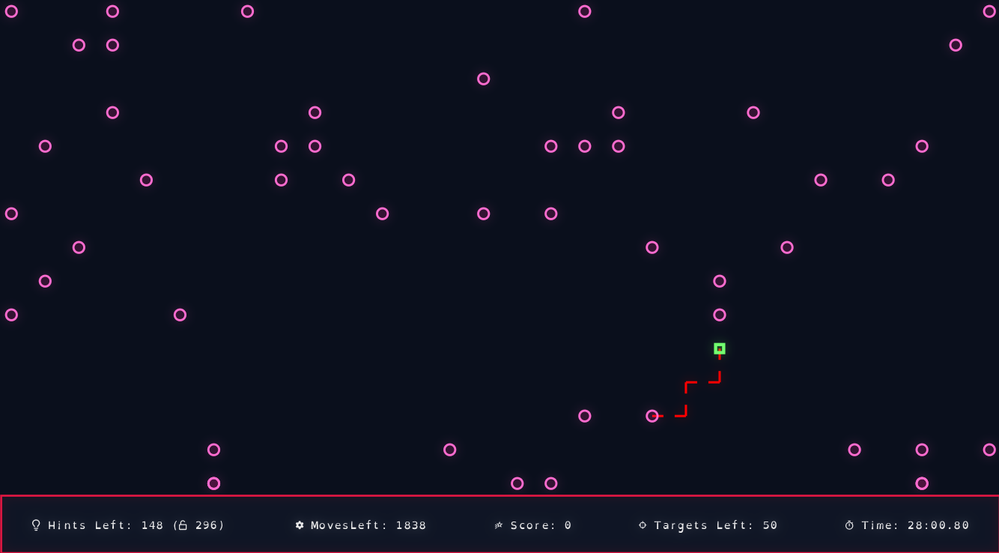

# WeaveMaze

- Minimum JDK = 17

## Running

### IntelliJ

Open Project, and run WeaveMaze in Main.scala.

### sbt
Have sbt and JDK installed, and inside the project's directory, run:

```bash
sbt run
```

---
## Controls
- Press any key to start
- *Arrow Keys* for movement
- Hold *Space* to show a hint
- If the player reached target, click *Enter* to collect the target
- *S* to take a screenshot

---
## Game Logic

### Difficulty System
Difficulty is a fractional value between 0 and 1 that influences:
- **Maze size**: Higher difficulty leads to more rows and columns unless a valid number of rows and columns are set by the user.
- **Bridge density**: More connections between cells for harder navigation.
- **Time**: Less total time to complete the maze.
- **Target bonuses**: Reduced time per target at higher difficulty.
- **Moves**: Players are given fewer bonus moves per target when difficulty increases.

Difficulty is applied equally to the first three parmeters, unless the first 2 are set by the user. In that case, we increase the difficulty factor for the the third parmeter.

### Scoring System
Scoring rewards the player for:
- **Reaching targets**: Each target grants `200` base points.
- **Time efficiency**: The faster the player reaches a target, and the more difficult the game is, the more bonus points awarded. The formula is:
  ```
  TimeScore * difficulty * distanceToTarget / timeSpent
  ```
  where `TimeScore` is a scaling constant, so more difficult settings can yield higher scores if played efficiently.
- **Infinite mode**: If enabled, after collecting all targets:
  - New targets are added
  - Remaining moves are accumulated based on difficulty
  - Bonus scores, additional time, and additional moves are granted.

### Hints
Players start with a limited number of hints (based on number of targets and a `hintsFactor`). Using a hint temporarily shows the solution path and hides the maze then imposes cooldowns and reduces remaining hints.



## Music Credit
https://pixabay.com/users/ihatetuesdays-39387169/
